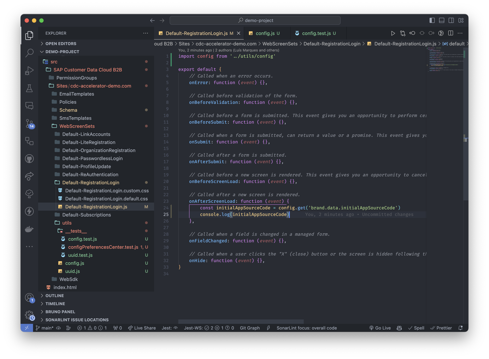
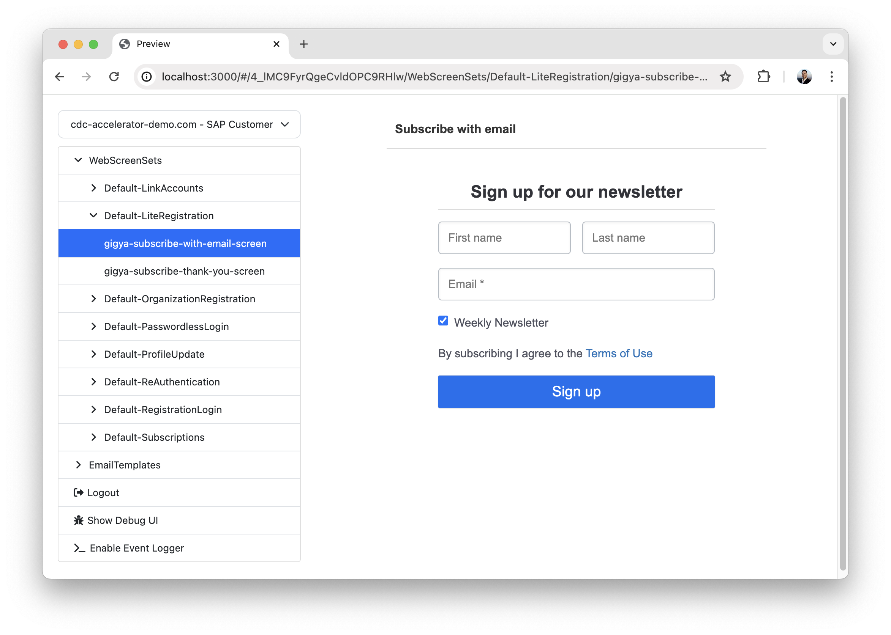

# Customer Data Cloud Accelerator

## About The Project <a id="description"></a>

The SAP Customer Data Cloud accelerator is local development environment for SAP Customer Data Cloud.

It enables the use of all modern tools, including modern JavaScript and real source control. It provides code separation, enabling unit tests and quality checks.

<a href="docs/screenshots/vscode.png"></a>
<a href="docs/screenshots/preview-screenset-1.png"></a>

## Getting Started <a id="requisites"></a>

To get started it is necessary to have **[git](https://git-scm.com/)** and **[node.js](https://nodejs.org/)** installed on the local machine.

### 1. Setup a CDC project <a id="setup"></a>

<!-- Firstly, please head towards the npm link https://www.npmjs.com/package/@sap_oss/sap-customer-data-cloud-accelerator. -->

Execute the following commands:

```sh
# Create a new project
npm init

# Install @sap_oss/sap-customer-data-cloud-accelerator as a development dependency of the new project
npm install --save-dev @sap_oss/sap-customer-data-cloud-accelerator

# Setup a new CDC project with dependencies configuration files
npx cdc setup
```

### 2. Project Configuration <a id="project-configuration"></a>

#### 2.1 User Credentials <a id="configuration-user-credentials"></a>

Edit the file `.env` in the project directory and add your credentials:

```sh
USER_KEY="ex: XXXXXXXX"
SECRET_KEY="ex: XXXXXXXXXXXXXXXXXXXXXXXXXXXX"
```

#### 2.2 Configuration file <a id="single-environment-configuration-file"></a>

Edit the file `cdc-accelerator.json` in the project directory and add the `source` site or sites you want to get the initial configuration from and sites to `deploy` to:

```sh
{
  "source": [
      { "apiKey": "XXXXXXXXXX" },
      { "apiKey": "YYYYYYYYYY" }
  ],
  "deploy": [
      { "apiKey": "XXXXXXXXXX" },
      { "apiKey": "YYYYYYYYYY" }
  ]
}
```

### 3. Usage <a id="single-environment-usage"></a>

#### 3.1 Get initial configuration from the source API Key(s) <a id="single-environment-usage-init"></a>

```sh
npm run init
```

#### 3.2 Start local development server <a id="single-environment-usage-start"></a>

```sh
npm run start
```

Navigate to <http://localhost:3000/> to see the preview.

The preview mode is a feature that allows the user to see and test the changes in the local environment, without the need to `deploy` the data to the SAP CDC console.

#### 3.3 Run tests (optional) <a id="single-environment-usage-test"></a>

```
npm run test
```

Runs any existing `jest` tests in the project.

#### 3.4 Deploy the local data to the SAP CDC console <a id="single-environment-usage-deploy"></a>

```sh
npm run deploy
```

Congratulations! You have successfully initialized and deployed a SAP Customer Data Cloud accelerator project.

### Advanced Usage <a id="single-environment-advanced-usage"></a>

#### Replace existing files with the code from the origin API Key(s) <a id="single-environment-usage-reset"></a>

It's similar to `init`, but replaces the contents of `src/`.

```sh
npm run reset
```

#### Get help about using the cli <a id="single-environment-usage-help"></a>

This command will show all possible commands and options that the user can do.

```sh
npx cdc help
```

Example output:

```sh
Usage: npx cdc [options] [command]

A development environment for SAP Customer Data Cloud that enables the use of modern tools, such as JavaScript and source control.

Options:
  -V, --version     output the version number
  -h, --help        display help for command

Commands:
  start             Launch local server for testing using the preview functionality
  setup             Setup a new project after this dependency is installed
  init [options]    Reads the data from the SAP CDC console of the sites configured
  reset [options]   Deletes the local folder and reads the data from the SAP CDC console of the sites configured
  build [options]   Processes the local data and prepares it to be deployed to the SAP CDC console
  deploy [options]  Deploys the local data to the SAP CDC console on the sites configured
  help [command]    display help for command
```

## Configuration <a id="configuration"></a>

### Feature Configuration <a id="configuration-features"></a>

The Customer Data Cloud Accelerator allows reading, working locally and deploying data from the following features:

-   Web SDK: `WebSdk` ([Example Code](src/SAP%20Customer%20Data%20Cloud/Sites/cdc-accelerator.demo-site.com/WebSdk/))

-   Web ScreenSets: `WebScreenSets` ([Example Code](src/SAP%20Customer%20Data%20Cloud/Sites/cdc-accelerator.demo-site.com/WebScreenSets/Default-RegistrationLogin/))
-   E-mail Templates: `EmailTemplates` ([Example Code](src/SAP%20Customer%20Data%20Cloud/Sites/cdc-accelerator.demo-site.com/EmailTemplates/))
-   SMS Templates: `SmsTemplates` ([Example Code](src/SAP%20Customer%20Data%20Cloud/Sites/cdc-accelerator.demo-site.com/SmsTemplates/))
-   Policies: `Policies` ([Example Code](src/SAP%20Customer%20Data%20Cloud/Sites/cdc-accelerator.demo-site.com/Policies/))
-   Schema: `Schema` ([Example Code](src/SAP%20Customer%20Data%20Cloud/Sites/cdc-accelerator.demo-site.com/Schema/))
-   Permission Groups: `PermissionGroups` ([Example Code](src/SAP%20Customer%20Data%20Cloud/PermissionGroups/))

### How to configure the use of features on the file cdc-accelerator.json

On the `cdc-accelerator.json` file, there are two mandatory properties that the user has to fill, the `source` and `deploy`.
They both will have an array of objects that will contain the apiKeys that are related to the sites that we want to use in the project and optionally it will have the features, for example:

```json
{
    "source": [
        {
            "apiKey": "1_QWERTYUIOPASDFGHJKLZXCVBNM",
            "features": ["Schema", "PermissionGroups", "WebSdk"]
        }
    ]
}
```

[Example Code](cdc-accelerator.json)

### An empty array will mean no feature will be available, for example:

```json
{
    "source": [
        {
            "apiKey": "1_QWERTYUIOPASDFGHJKLZXCVBNM",
            "features": []
        }
    ]
}
```

### How to use the feature-specific commands

Using the feature-specific command lets the user run a specific feature instead of running all of them when doing an operation (init, reset, build, deploy).
To use them, simply write on the terminal

```sh
npm run <operation> -- -f <featureName>
```

For example:

```sh
npm run init -- -f Schema
```

In this example the user is only going to run the feature Schema when running the operation init, the feature name can be replaced by any other feature (Email Templates, WebScreenSet, PermissionGroup, WebSdk...).
To show all the possible commands, the user can write simply

## Features <a id="features"></a>

### WebSdk <a id="features-web-sdk"></a>

You can separate the WebSdk into different files and use the `import` and `export` statements to organize the code.
Using code segregation enables the use of unit tests and quality checks.

[Example Code](src/SAP%20Customer%20Data%20Cloud/Sites/cdc-accelerator.demo-site.com/WebSdk/)

#### webSdk.js

```js
export default {
    // A comma-delimited list of provider names to enable.
    enabledProviders: '*',

    // Define the language of Gigya's user interface and error message.
    lang: 'en',

    // Bind globally to events.
    customEventMap: './customEventMap/customEventMap.js',

    // Custom global methods
    utils: './utils/utils.js',

    // Custom variables
    customPaths: './customPaths/customPaths.js',
}
```

#### customEventMap/customEventMap.js

```js
export default {
    eventMap: [
        {
            events: '*',
            args: [
                function (e) {
                    return e
                },
            ],
            method: function (e) {
                if (e.fullEventName === 'login') {
                    // Handle login event here.
                } else if (e.fullEventName === 'logout') {
                    // Handle logout event here.
                    // console.log('here');
                }
            },
        },
    ],
}
```

#### utils/utils.js

```js
export default {
    // Custom global methods
    customMethod: function () {
        // Custom method code
    },
}
```

#### customPaths/customPaths.js

```js
export default {
    pathRedirectLogin: '/login',
    pathRedirectLogout: '/',
}
```

### WebScreenSets <a id="features-webscreensets"></a>

Using code segregation enables the use of unit tests and quality checks.

[Example Code](src/SAP%20Customer%20Data%20Cloud/Sites/cdc-accelerator.demo-site.com/WebScreenSets/Default-RegistrationLogin/)

#### WebScreenSets JavaScript

You can separate the WebScreenSets JavaScript code into different files and use the `import` and `export` statements to organize the code.

##### Default-RegistrationLogin.js

```js
import customFunctionalityOnAfterScreenLoad from '.customFunctionalityOnAfterScreenLoad.js'

export default {
    onError: function (event) {},

    onBeforeValidation: function (event) {},

    onBeforeSubmit: function (event) {},

    onSubmit: function (event) {},

    onAfterSubmit: function (event) {},

    onBeforeScreenLoad: function (event) {},

    onAfterScreenLoad: function (event) {
        customFunctionalityOnAfterScreenLoad.exampleMethod()
    },

    onFieldChanged: function (event) {},

    onHide: function (event) {},
}
```

##### customFunctionalityOnAfterScreenLoad.js

```js
import config from 'utils/config'

export default {
    pathRedirectLogin: config.get('customPaths.pathRedirectLogin', '/login'),
    pathRedirectLogout: config.get('customPaths.pathRedirectLogout', '/'),

    profileUpdateScreen: 'gigya-update-profile-screen',
    classLogoutButton: 'button-logout',

    exampleMethod: function () {
        const logoutButton = document.querySelector(`.${this.classLogoutButton}`)
        console.log({ logoutButton, pathRedirectLogout: this.pathRedirectLogout })
    },
    ...
}
```

##### utils/config.js

Utility function to get a value from the WebSdk.

```js
export default {
    get(configName, defaultValue) {
        try {
            const properties = configName.split('.')
            return properties.reduce((acc, prop) => acc[prop] || defaultValue, gigya.thisScript.globalConf)
        } catch (e) {
            return defaultValue
        }
    },
}
```

#### WebScreenSets CSS

The CSS is separated into different files:

-   `default.css` - The default CSS from SAP CDC.
-   `custom.css` - The file to write all the custom CSS.

It's helpful to keep these files separate to avoid conflicts and to make it easier to maintain the code.

[Example Code](src/SAP%20Customer%20Data%20Cloud/Sites/cdc-accelerator.demo-site.com/WebScreenSets/Default-RegistrationLogin/)

<!-- ### EmailTemplates <a id="features-email-templates"></a>

### SmsTemplates <a id="features-sms-templates"></a>

### Policies <a id="features-policies"></a>

### Schema <a id="features-schema"></a>

### PermissionGroups <a id="features-permission-groups"></a> -->

## Preview

The preview mode is a feature that allows the user to see and test the changes in the local environment, without the need to `deploy` the data to the customer data cloud console.

[Example Code](src/index.html)

### How to use filters on preview

The filter is applied on the "src/index.html" file, that will filter the screens that the user will choose to see by using the apiKeys that are configured on the configuration file `cdc-accelerator.json`, for example:

```sh
[{
    apiKey: '1_2ABCDEFGHI345',
    screens: [{ screenSetID: 'PreferencesCenter-ProfileUpdate', screenID: 'gigya-update-profile-screen' }],
    emails: [ { emailID: 'codeVerification', languages: ['en'] } ]
}]
```

### Using the filter on more than one apiKey

```sh
[{
    apiKey: '1_2ABCDEFGHI345',
    screens: [
        { screenSetID: 'PreferencesCenter-ProfileUpdate', screenID: 'gigya-update-profile-screen' },
        { screenSetID: 'PreferencesCenter-Landing', screenID: 'gigya-login-screen' },
    ],
    emails: []
},
{
    apiKey: '1_3AS9DJAKSLA12',
    emails: [{ emailID: 'doubleOptIn', languages: ['ar', 'en', 'pt-br'] }]
}]
```

### Adding the filter to all the ApiKeys that do not have already a specific filter

```sh
[{
    apiKey: '*',
    emails: [{ emailID: 'doubleOptIn', languages: ['ar', 'en', 'pt-br'] } ]
}]
```

### Using different options of preview

Using the different options of the preview will enable the user to control what he wants to see or filter.

-   `<origin>`: Retrieves the settings available on the `source` or `deploy` inside the `cdc-accelerator.json`.

-   `<useLocalWebSdk>`: Uses the local webSdk.js code that is inside the build/ directory.

-   `<useLocalScreenSets>`: Uses the local screensets.js code that is inside the build/ directory.

-   `<filter>`: Defines what was configured above, including specific apiKeys and screens/email.

-   `<lang>`: Defines the language of the screen-sets, which can be changed according to user preference.

```js
preview({
    origin: 'source',
    useLocalWebSdk: true,
    useLocalScreenSets: true,
    filter,
    lang: 'en',
})
```

## Support, Feedback, Contributing

This project is open to feature requests/suggestions, bug reports etc. via [GitHub issues](https://github.com/SAP/sap-customer-data-cloud-accelerator/issues). Contribution and feedback are encouraged and always welcome. For more information about how to contribute, the project structure, as well as additional contribution information, see our [Contribution Guidelines](CONTRIBUTING.md).

## Code of Conduct

We as members, contributors, and leaders pledge to make participation in our community a harassment-free experience for everyone. By participating in this project, you agree to abide by its [Code of Conduct](https://github.com/SAP/.github/blob/main/CODE_OF_CONDUCT.md) at all times.

## Licensing

Copyright 2023 SAP SE or an SAP affiliate company and sap-customer-data-cloud-accelerator contributors. Please see our [LICENSE](LICENSE) for copyright and license information. Detailed information including third-party components and their licensing/copyright information is available [via the REUSE tool](https://api.reuse.software/info/github.com/SAP/sap-customer-data-cloud-accelerator).
